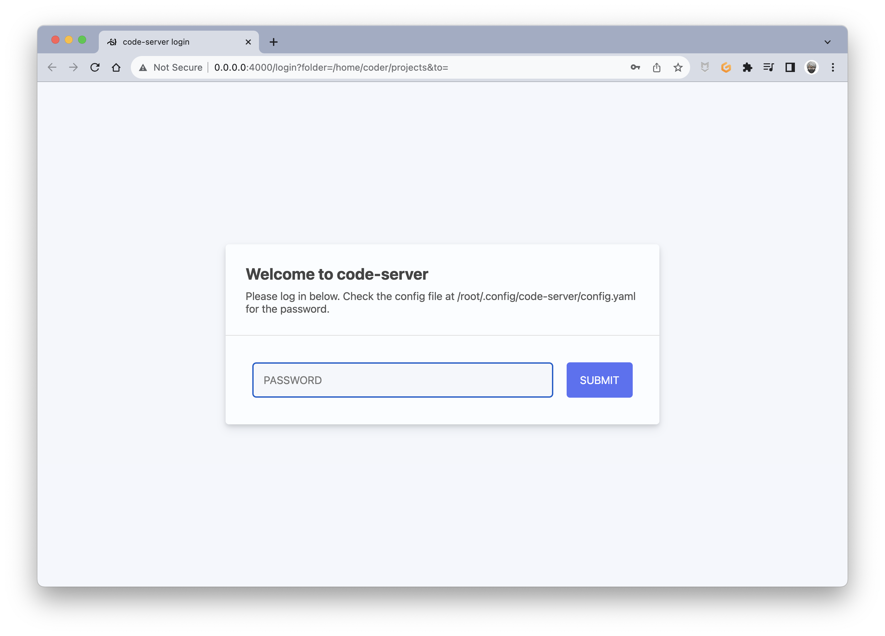
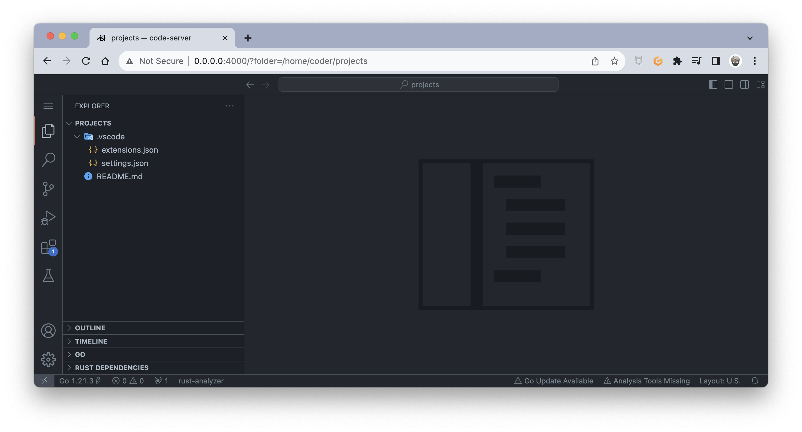
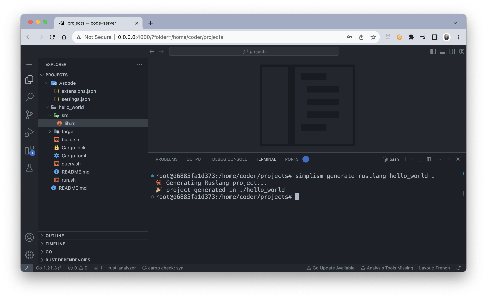
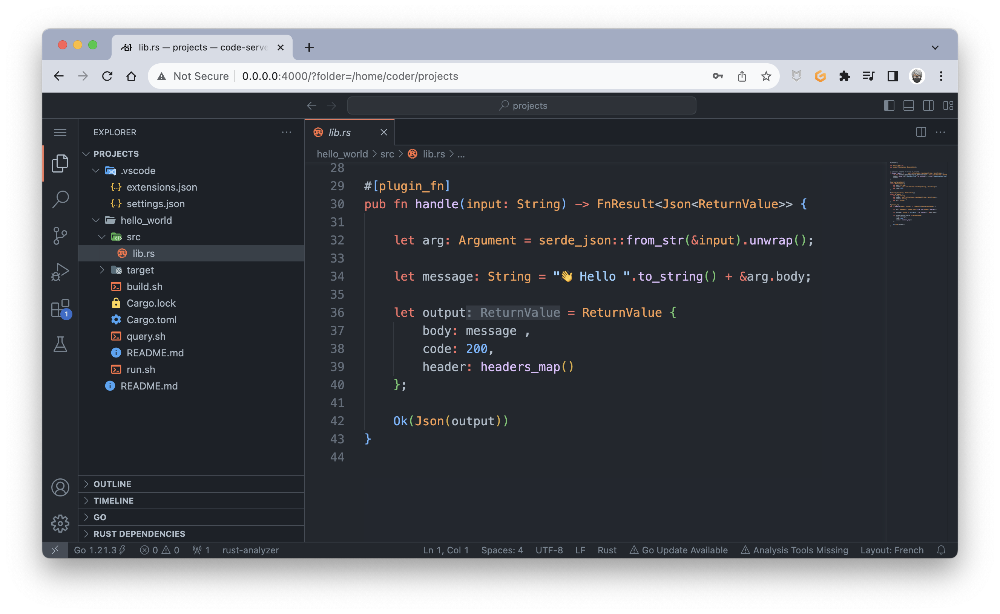
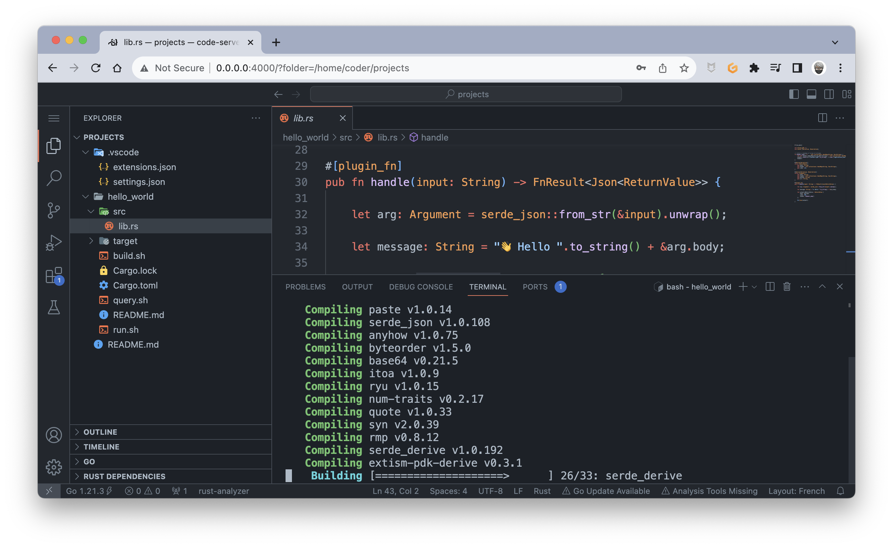
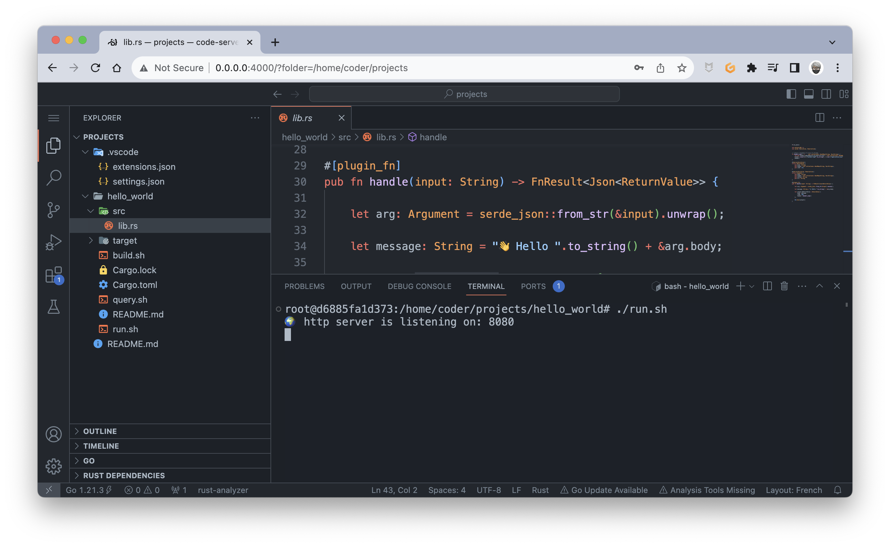
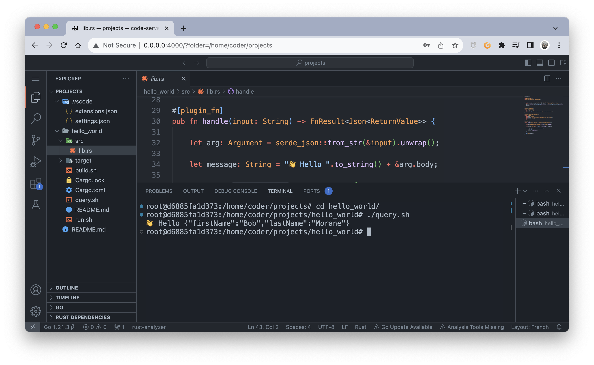

# Simplism IDE

## What is Simplism IDE?

Simplism IDE is a "local cloud development environment" (*) to develop [Extism](https://extism.org/) plug-ins for the [Simplism](https://github.com/bots-garden/simplism#simplism-a-tiny-http-server-for-extism-plug-ins) HTTP server without the need to install all the "complicated things".

> (*) but you can use it remotely

## How to run it?

> - ✋✋✋ Right now, Simplism IDE runs only on arm64 platforms (pull requests are welcome 🤗) 
> - Otherwise, you can [🍊 Open it with Gitpod](https://gitpod.io/#https://github.com/bots-garden/simplism-ide)
>   - Open `simplism-ide.code-workspace`
>   - Click on <kbd>Open Workspace</kbd>

1. You need [Docker](https://www.docker.com/) and [Docker Compose](https://docs.docker.com/compose/)
2. Next, clone this repository: `git clone https://github.com/bots-garden/simplism-ide.git`
3. Run `docker compose up` into the `simplism-ide` directory
4. Go to: http://0.0.0.0:4000/?folder=/home/coder/projects

## How to use it? (Write your first plug-in)

### Log-in
> 👋 the default password is **`ilovepandas`**


> 🎉 Tada!


### Generate a plug-in Rust project

To generate a rust plug-in project, type the following command:
```bash
simplism generate rustlang hello_world .
```


You can, of course, change the source code (if needed, restart **rust-analyzer**).


### Build the project

To build the project, type the following command:
```bash
cd hello_world
./build.sh
```
It will produce a wasm file: `./target/wasm32-wasi/release/hello_world.wasm`


### Run Simplism to serve the wasm plug-in

To build the project, type the following command:
```bash
cd hello_world
./run.sh
```


### Query the new "nano wasm service"

To build the project, type the following command:
```bash
cd hello_world
./query.sh
```


✋ That's all 🤗

## How to

### Change the password

You need to edit `workspace/.config/code-server/config.yaml` and change the value of `password`:

```yaml
auth: password
password: yourpassword
```

### Add a TLS certificate

- First, copy the certificate and the key to `workspace/certs`, 
- Then, change the permissions of the 2 files: `chmod 777 your.domain.*`
- Finally, edit `workspace/.config/code-server/config.yaml`:

```yaml
auth: password
password: yourpassword
cert: certs/your.domain.crt
cert-key: certs/your.domain.key
```

The new URL to the Simplism IDE will be: https://your.domain:4000/?folder=/home/coder/projects

> 👋 don't forget **`https`**

### Add your tools

- Edit `Dockerfile`
- Rebuild: `docker compose build`
